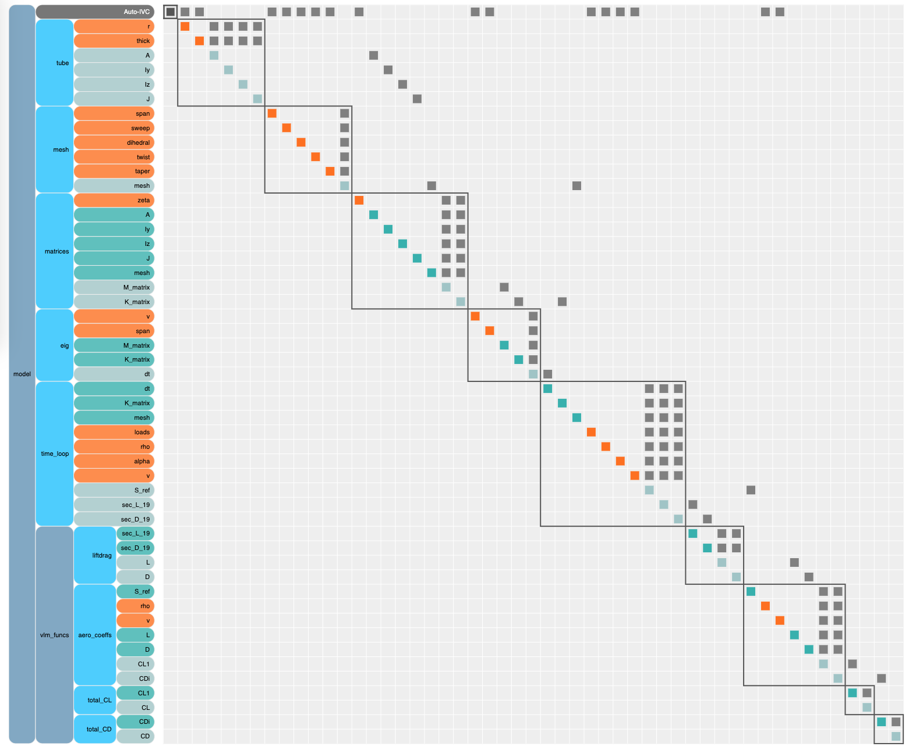

# Original Request From @shamsheersc19

## Background:
* [OpenAeroStruct (OAS)][0] is gaining popularity and is often advertised as a good example of a practical application that takes advantage of the strengths of OpenMDAO.
* A few years ago, Giovanni Pesare implemented an unsteady VLM solver with OAS with a little direction from @shamsheersc19 (see attached thesis).
* In order to take advantage of OpenMDAO's analytic derivatives, the only clear path was to stamp out copies 
of the time-varying states for each time instance inside an OpenMDAO model. 
* This seems like a less than ideal way to set it up, are there better ways? 

# Structure of an unsteady problem

As Giovanni Pesare points out in his thesis, an unsteady problem is made up of three parts: 

1) A block of computations before the unsteady part
2) The unsteady part
3) A block of computations after the unsteady part


In this code, we can see that the before block includes the groups named `tube`, `mesh`, `matricies`, and `eig`. 
The entire unsteady block is contained inside the `coupled` group (that's a weird name for that group since nothing is coupled, but we wanted to change the code as little as possible so we left it.)
The after block is contained in the `vlm_funcs` group. 

The waterfall nature of this time loop clearly shows up in the N2 diagram above where each time step feeds directly into the next. 
This style of unsteady model is not the most efficient way to set it up. 
You have to keep all times in memory at once, but you're also constrained to evaluating all times in sequence. 

A better approach would be to wrap the time-loop into a component that does the time-stepping for you with a sub-problem to hold the guts of the time-varying calculation. 

## Converting the analysis into a time-loop

In order to break the model down we needed to map the I/O from the *before block* into the time loop, 
the i/o between each time step, and the i/o to the *after block* from the time loop. 

### I/O: Before block -> time loop  
Using the N2, we can see what the various inputs variables are: `dt`, `K_matrix`, `mesh`, `loads`, `rho`, `alpha`, `v`


### I/O: time_i -> time_i+1

Again, using the N2 diagram we can find the necessary data passing: `circ_{i}`, `circ_wake_{i}`, `wake_mesh_{i}`, `sigma_x_{i}`, `disp_{i}`


### I/O: time loop -> after block

Lastly we have the inputs from the time-loop to the final calculation block: 
`S_ref` (which is a bit weird, because it comes from time step 0)
`sec_L_19`, an `sec_D_19`. 


### The model is much simpler with a for loop

At the run-script level, the changes are extremely minor. 
Commented out parts are from the non-for loop part.  

```python 

# Time loop
# coupled = om.Group()
# for t in range(num_dt):
#     name_step = 'step_%d'%t
#     coupled.add_subsystem(name_step,
#                 SingleStep(num_x, num_y_sym, num_w, E, G, mrho, fem_origin, SBEIG, t),
#                 promotes=['*'])

# root.add_subsystem('coupled',
#          coupled,
#          promotes=['*'])

root.add_subsystem('time_loop', TimeLoopComp(num_x, num_y_sym, num_w, E, G, mrho, fem_origin, SBEIG, num_dt), 
                   promotes=['*'])
```
The change in the N2 is much more visible. 
The waterfall of time steps is now gone. 


You can see the full code to make this work [here](./timeloop.py) in the `TimeLoop` class. 
The key bit is here, where you should notice that the for-loop that was commented out of the run-script has been transferred into the run and there are now a set of sub-problems. 

```python
def compute(self, inputs, outputs): 

    num_dt = self.num_times 
    p0 = self._prob0

    p0['dt'] = inputs['dt']
    p0['K_matrix'] = inputs['K_matrix']
    p0['mesh'] = inputs['mesh']
    p0['loads'] = inputs['loads']
    p0['rho'] = inputs['rho']
    p0['alpha'] = inputs['alpha']
    p0['v'] = inputs['v']

    p0.run_model()

    circ = p0['circ_0'].copy()
    # circ_wake = p0['circ_wake_0'].copy()
    wake_mesh = p0['wake_mesh_1'].copy()
    sigma_x = p0['sigma_x_0'].copy()
    disp = p0['disp_0']

    for t in range(1,num_dt):

        pi = om.Problem()

        # NOTE: The size of the wake mesh grows with each iteration, so we need to re-do setup each time
        pi.model.add_subsystem('step', SingleStep(self.num_x, self.num_y, self.num_w, self.E, 
                               self.G, self.mrho, self.fem_origin, self.SBEIG, t=t), 
                               promotes=['*'])

        pi.setup()
        pi.final_setup()

        pi['dt'] = inputs['dt']
        pi['K_matrix'] = inputs['K_matrix']
        pi['mesh'] = inputs['mesh']
        pi['loads'] = inputs['loads']
        pi['rho'] = inputs['rho']
        pi['alpha'] = inputs['alpha']
        pi['v'] = inputs['v']

        pi[f'circ_{t-1}'] = circ
        if t > 1: 
          pi[f'circ_wake_{t-1}'] = circ_wake
        pi[f'wake_mesh_{t}'] = wake_mesh
        pi[f'sigma_x_{t-1}'] = sigma_x
        pi[f'disp_{t-1}'] = disp

        pi.run_model()

        # save the data to pass to the next time instance
        circ = pi[f'circ_{t}'].copy()
        circ_wake = pi[f'circ_wake_{t}'].copy()
        wake_mesh = pi[f'wake_mesh_{t+1}'].copy()
        sigma_x = pi[f'sigma_x_{t}'].copy()
        disp = pi[f'disp_{t}'].copy()

    outputs['S_ref'] = p0['S_ref']
    outputs['sec_L_19'] = pi['sec_L_19']
    outputs['sec_D_19'] = pi['sec_D_19']
```

### What about derivatives? 
This is one area where the waterfall is a bit easier to work with. 
By chaining everything the way that the original run script did, OpenMDAO handled the derivatives for you. 
When you move the for loop into the component, you're now responsible for the derivatives yourself. 

We didn't do the derivatives here, mostly for lack of time. 
We admit that they are a bit tricky, and you need to be fairly experienced with derivatives to handle them efficiently and in a way that won't negate all the memory savings from pushing the for loop down into 
the component in the first place. 

If you interested in this topic, check out the [docs on the matrix-free total derivatives](http://openmdao.org/twodocs/versions/3.4.0/features/core_features/working_with_derivatives/total_compute_jacvec_product.html). 

In future updates to Dymos, we are looking at building in this kind of time-stepping approach. 


### Notes on the use of sub-problems in this application 

This for-loop uses a lot of sub-problems. 
There is one for time 0, then one more for every time step after that. 
The one for time 0 is persistent, but the other times get discarded as you move through the loop. 

This multi-problem structure did not have to be here in general, but due to specifics of how the original code was implemented (the `SingleStep` group changed a bit depending on the time-step) it was necessary to preserve multiple instances in the for loop as well. 


