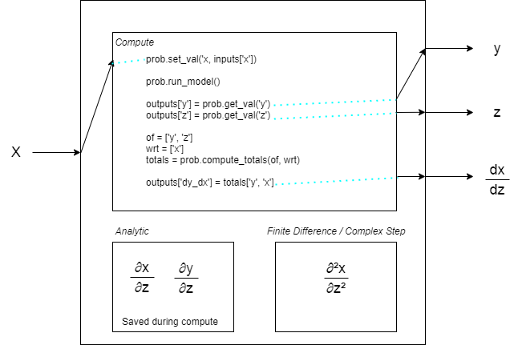

# Original Problem Statement

* We're interested in optimizing a vehicle subject to aerodynamic stability requirements. This is a
novel OpenMDAO problem because it requires constraining derivatives of components, not just
values themselves.

* We envision using OpenAerostruct (since it has analytical derivatives) to drive parameters such as
dihedral and taper ratio to some objective (weight, range, etc.,) subject to stability derivatives
(Cnbeta, Cmalpha, etc.) being greater than some value.

* The aero stability equations are straightforward - they're the derivatives of each 6 forces and
moments with respect to alpha, beta, rotation rates, velocity, and control surface deflections.

* We don't think OpenAerostruct has roll rates or control surface deflections, so this example could
just be alpha, beta, and freestream velocity.

* We view the test problem as having a dihedral wing and a V-tail. The objective would be to minimize
wing weight, subject to Cn-beta and Cm-alpha constraints. We can provide baseline geometry.

# Optimization Problem

Problem: eCRM-001 Wing/Vertical Tail/Horizontal Tail but with addition of dihedral to wing

Objective: Maximize L/D @ 150 mph

Constraints @ 70 mph, 150 mph, 200 mph:
* -CM_α/CL_α > 0.0
*  CN_β > 0.0
*  CL < 1.3
*  CL = W/qS

Design Variables:
*  Vertical Tail Area
*  Horizontal Tail Area
*  Wing Chord
*  α @ each speed

# Tools Needed

**VSP**

Installing vsp is covered in this [document.](openmdao_with_vsp.md)

**OpenAerostruct**

OpenAerostruct can be installed by cloning the repository and installing it into an activated OpenMDAO
environment following the instructions they give.

There is a bug in the existing version of OpenAerostruct where beta (sideslip angle) is not
promoted out of an AerostructGroup. We have fixed this and will submit it back to the OAS repo at
the conclusion of the reverse-hackathon.

# Overall Approach

In the proposed optimization problem, we want to apply constraints to stability derivatives. The
stability derivatives that we need are the derivatives of aerodynamic forces with respect to angle
of attack (alpha) and sideslip angle (beta).  OpenMDAO can compute these derivatives, however
there is no way to use the derivatives inside of a model. Moreover, to use a derivative as a constraint,
you also need its derivatives, which are the second derivatives of the aero forces with respect
to alpha and beta. The way to accomplish this in OpenMDAO is to use a nested Problem.

# Challenges

## 1. How can OpenMDAO provide derivatives to use as outputs.

This problem was proposed to the workshop in order to answer the question of how to compute
total derivatives of part of your model and use them for later calculation in OpenMDAO. To be
completely flexible, these derivatives need to be an output of some kind of component so that
they can be used as inputs to other components or declared as constraint sources. However, whenever
an output is provided in OpenMDAO, the component that computes it must also be able to provide
partial derivatives of that input with respect to component inputs. So, even if we could somehow
piggyback on the full-model total derivatives capability to compute the derivatives of a sub-model
and provide them as outputs, we would still need to compute second derivatives, and OpenMDAO
does not provide those at this time.

So this means we need to consider other approaches. One way to compute derivatives on part of
a model is to take that portion of the model and place it in a sub-problem. The portion that needs
to be compartmentalized is the set of components that are relevant between the output (the "of" in the
derivative) and the input (the "wrt" in the derivative.) As a sub-problem, we can set the new
values of the inputs, call "run_model" on it to compute the outputs, and call "compute_totals" on
it to compute the derivatives.

OpenMDAO doesn't have an "automatic" way to place problems into models. To do this, you need to create
an `ExplicitComponent` that contains the subproblem and manages the passing of data. This isn't
as difficult as it sounds, and is one of the primary focuses that is documented in this solution.

For a simple example, consider a component that takes `x` and computes `y` and `z`. We also want to
compute `dy_dx` and use it in OpenMDAO.  If we take the subproblem approach, then we create a
component that wraps a problem.  The problem just needs to take `x` from the component inputs, pass
it into the sub-problem, run the sub-problem, and return the results `y` and `z`.  To get the
derivative, we also need to call `compute_totals` on the sub-problem, and return the derivative as
well.



While we call `compute_totals` on the sub-problem, it is most efficient to save the derivatives we
calculate and return them during our component's `compute_partials`. OpenMDAO cannot compute second
derivatives, so the derivative of `dy_dx` with respect to `x` is computed by finite difference or
complex step.

For our aircraft case, we want to compute and constrain the derivatives of aerodynamic variables with
respect to alpha and beta. This means we need to encapsulate OpenAerostruct in the sub-problem.
While we technically don't need the geometry to be included in the subproblem, since it is not
involved in the calculation of the stability derivatives, we included it because it is more
computationally efficient, as will be explained later.  Wrapping OpenVSP and incorporating it
into an OpenAerostruct model is also explained in a later section.

Here is the first part of the component.  It contains an attribute `self._problem` that holds the
subproblem. This problem will only be setup once.

The inputs include the three geometry inputs and the angle of attack "alpha". These will all design
variables for the full optimization problem.  The rest of the inputs are constants.
```
class ECRM(om.ExplicitComponent):
    """
    Component wrapper that contains an OpenMDAO problem with VSP and OpenAeroStruct.

    Attributes
    ----------
    _problem : <Problem>
        OpenMDAO Problem that this component runs.
    """

    def __init__(self, **kwargs):
        super().__init__(**kwargs)

        self._problem = None

        # Added a switch to disable them when I was just doing parameter studies on the lift
        # constraint.
        self._calc_stability_derivs = True
        self._totals = {}

    def initialize(self):
        self.options.declare('wing_surface', types=dict, default={},
                             desc="Dict containing settings that define the OAS surface "
                             "for the wing.")
        self.options.declare('horiz_tail_surface', types=dict, default={},
                             desc="Dict containing settings that define the OAS surface "
                             "for the horizontal tail.")
        self.options.declare('vert_tail_surface', types=dict, default={},
                             desc="Dict containing settings that define the OAS surface "
                             "for the vertical tail.")
        self.options.declare('num_nodes', default=1,
                             desc='Number of flight points to run.')

    def setup(self):
        num_nodes = self.options['num_nodes']

        # Design Parameters
        self.add_input('v', val=248.136 * np.ones(num_nodes), units='m/s')
        self.add_input('alpha', val=np.ones(num_nodes), units='deg')
        self.add_input('Mach_number', val=0.1 * np.ones(num_nodes))

        # VSP Geometry Parameters
        self.add_input('wing_cord', val=59.05128, units='cm')
        self.add_input('vert_tail_area', val=2295., units='cm**2')
        self.add_input('horiz_tail_area', val=6336., units='cm**2')

        # Constant Inputs
        self.add_input('beta', val=0.0, units='deg')
        self.add_input('re', val=1.0e6, units='1/m')
        self.add_input('rho', val=0.38, units='kg/m**3')
        self.add_input('CT', val=grav_constant * 17.e-6, units='1/s')
        self.add_input('R', val=50.0, units='km')
        self.add_input('W0', val=2000.0,  units='kg')
        self.add_input('speed_of_sound', val=295.4, units='m/s')
        self.add_input('load_factor', val=1.)
        self.add_input('empty_cg', np.array([262.614, 0.0, 115.861]), units='cm')
```
Next are the outputs. We need "CL" and "CD" to compute the L/D objective for the optimization. We
also need the "L_equals_W" output, which contains the value of the constraint where lift equals
weight. We don't need to declare outputs for any OpenAerostruct variables that aren't part of the
optimization problem, though if you want any other variables to be recorded for later study, you
should include them as outputs here. Finally, we have outputs for the three stability derivatives
that we need.
```
        # Outputs
        self.add_output('CL', np.zeros(num_nodes))
        self.add_output('CD', np.zeros(num_nodes))

        self.add_output('CM_alpha', np.zeros(num_nodes))
        self.add_output('CL_alpha', np.zeros(num_nodes))
        self.add_output('CN_beta', np.zeros(num_nodes))

        self.add_output('L_equals_W', np.zeros(num_nodes))
```
Next, we need to declare our partial derivatives. This is a little tricky, so let's consider the
derivatives of the regular outputs first:
```
    def setup_partials(self):
        num_nodes = self.options['num_nodes']

        # This component calculates all derivatives during compute.
        self.declare_partials(of=['CL', 'CD', 'L_equals_W'],
                              wrt=['wing_cord', 'vert_tail_area', 'horiz_tail_area'],
                              rows=np.arange(num_nodes), cols=np.zeros(num_nodes))
        self.declare_partials(of=['CL', 'CD', 'L_equals_W'],
                              wrt=['alpha', 'v', 'Mach_number'],
                              rows=np.arange(num_nodes), cols=np.arange(num_nodes))
```
Here we define the derivatives of "C", "CD", and "L_equals_W" with respect to all inputs. We use
two calls because these are vectors and have slightly different sparsity patterns. Declaring them
here means that we are going to provide them in our "compute_partials" method.

Next, let's look at the partial derivatives of the stability derivatives with respect to all
inputs.
```
        # But we also need derivatives of the stability derivatives.
        # Those can only be computed with FD.
        self.declare_partials(of=['CM_alpha', 'CL_alpha', 'CN_beta'],
                              wrt=['alpha', 'v', 'Mach_number', 'wing_cord',
                                   'vert_tail_area', 'horiz_tail_area'],
                              method='fd', step_calc='rel')
```
Notice that we are using finite difference to compute these. This is, again, because OpenMDAO
cannot compute second derivatives. It is important to make sure that we only approximate the
derivatives that we can't get analytically so that we are doing this as efficiently as we can.
OpenMDAO can handle mixed-operation where some derivatives are analytic and some are finite
difference. Note also that, if your model supports it, you can use complex step here for
better accuracy.  We cannot because of OpenVSP.

This leads in to why we chose to include OpenVSP in the sub-problem. OpenVSP passes three deformed
meshes into the rest of OpenAerostruct. If we slpit the model there, then this component would no
longer have the three geometric design inputs, but would instead have 3 mesh inputs. We would
need to compute the derivatives of the stability derivatives with respect to every mesh coordinate
point, which would require many finite difference steps and be very time consuming. With VSP
included inside the sub-problem, we only have three geometry inputs to finite difference. You
need to consider this when building your sub-problems. Sometimes you can gain efficiency by pulling
more of your problem down into the sub-problem.

Next up is the compute function.
```
    def compute(self, inputs, outputs):
        num_nodes = self.options['num_nodes']
        prob = self._problem
```
The first time we call compute, we build the problem. You can often do this earlier, and this code
can possibly be moved to "setup" or "configure". Here, we build our sub-model, which contains VSP
and OpenAerostruct. Then we call setup.
```
        # Build the model the first time we run.
        if prob is None:
            opt = self.options
            wing_surface = opt['wing_surface']
            horiz_tail_surface = opt['horiz_tail_surface']
            vert_tail_surface = opt['vert_tail_surface']
            surfaces = [wing_surface, horiz_tail_surface, vert_tail_surface]

            prob = om.Problem()
            model = prob.model

            # Using manual indepvarcomp because of some promote errors in OAS if I omit it.
            indep_var_comp = om.IndepVarComp()
            indep_var_comp.add_output('v', val=248.136, units='m/s')
            indep_var_comp.add_output('alpha', val=0.0, units='deg')
            indep_var_comp.add_output('beta', val=0.0, units='deg')
            indep_var_comp.add_output('Mach_number', val=0.1)
            indep_var_comp.add_output('re', val=1.0e6, units='1/m')
            indep_var_comp.add_output('rho', val=0.38, units='kg/m**3')
            indep_var_comp.add_output('CT', val=grav_constant * 17.e-6, units='1/s')
            indep_var_comp.add_output('R', val=50.0, units='km')
            indep_var_comp.add_output('W0', val=2000.0,  units='kg')
            indep_var_comp.add_output('speed_of_sound', val=295.4, units='m/s')
            indep_var_comp.add_output('load_factor', val=1.)
            indep_var_comp.add_output('empty_cg', val=np.array([262.614, 0.0, 115.861]), units='cm')

            prob.model.add_subsystem('prob_vars', indep_var_comp, promotes=['*'])

            model.add_subsystem('geo', AerostructGeometries(surfaces=surfaces),
                                promotes_inputs=['wing_cord', 'vert_tail_area', 'horiz_tail_area'])

            # Create the aero point group, which contains the actual aerodynamic
            # analyses
            aero_struct_group = AerostructPoint(surfaces=surfaces)
            prob.model.add_subsystem('aero', aero_struct_group,
                                     promotes_inputs=['v', 'alpha', 'beta', 'Mach_number', 're', 'rho',
                                                      'CT', 'R', 'W0', 'speed_of_sound', 'load_factor',
                                                      'empty_cg'])

            # Mesh Connections for AeroStruct
            for surface in surfaces:
                name = surface['name']

                prob.model.connect(f'geo.{name}.local_stiff_transformed', f'aero.coupled.{name}.local_stiff_transformed')
                prob.model.connect(f'geo.{name}.nodes', f'aero.coupled.{name}.nodes')

                # Connect aerodynamic mesh to coupled group mesh
                prob.model.connect(f'geo.{name}_mesh', f'aero.coupled.{name}.mesh')

                # Connect performance calculation variables
                for vname in ['radius', 'thickness', 'nodes']:
                    prob.model.connect(f'geo.{name}.{vname}', f'aero.{name}_perf.{vname}')

                for vname in ['cg_location', 'structural_mass', ]:
                    prob.model.connect(f'geo.{name}.{vname}', f'aero.total_perf.{name}_{vname}')

                prob.model.connect(f'geo.{name}:t_over_c', f'aero.{name}_perf.t_over_c')

                # Finite Difference is faster.
                #prob.model.approx_totals(method='fd')

            prob.setup()
            self._problem = prob
```
The next sections of code run every time this component calls "Compute". The first thing we need to
do is to set all of our input values. We pull these values from the inputs vector that is passed
into our "compute". We do this every time with all of them, because we don't know which ones have
changed.
```
        # Set constants
        prob.set_val('beta', inputs['beta'])
        prob.set_val('re', inputs['re'])
        prob.set_val('rho', inputs['rho'])
        prob.set_val('CT', inputs['CT'])
        prob.set_val('R', inputs['R'])
        prob.set_val('W0', inputs['W0'])
        prob.set_val('speed_of_sound', inputs['speed_of_sound'])
        prob.set_val('load_factor', inputs['load_factor'])
        prob.set_val('empty_cg', inputs['empty_cg'])

        # Design inputs don't vary over cases.
        prob.set_val('wing_cord', inputs['wing_cord'])
        prob.set_val('vert_tail_area', inputs['vert_tail_area'])
        prob.set_val('horiz_tail_area', inputs['horiz_tail_area'])
```
In the next code block, we have three different cases we are looping over, one for each of three
flight conditions that we are running independently.
```
        for j in range(num_nodes):

            # Set new design values.
            prob.set_val('v', inputs['v'][j])
            prob.set_val('alpha', inputs['alpha'][j])
            prob.set_val('Mach_number', inputs['Mach_number'][j])
```
Next we run the sub problem.
```
            # Run Problem
            prob.run_model()
```
Now we can extract the outputs from the subproblem and set them into our component outputs.
```
            # Extract Outputs
            outputs['CL'][j] = prob.get_val('aero.CL')
            outputs['CD'][j] = prob.get_val('aero.CD')
            outputs['L_equals_W'][j] = prob.get_val('aero.L_equals_W')
```
Now, we just need the stability derivative outputs. To compute these, we need to prepare to
calculate total derivatives on our sub-problem. While we calculate those outputs, we also
calculate all the partial derivatives that those component can combine. The derivative
of "CL" with respect to "alpha", for example, is needed both as an output and as a partial
derivative on this component.

With this in mind, we carefully assemble our list of input/output variables for the calculation
of total derivatives.
```
            if self._calc_stability_derivs:

                # Compute all component derivatives.
                # Compute Stability Derivatives and
                of = ['aero.CL', 'aero.CD', 'aero.CM', 'aero.L_equals_W']
                wrt = ['alpha', 'beta', 'v', 'Mach_number',
                       'wing_cord', 'vert_tail_area', 'horiz_tail_area']
```
And then we compute them.
```
                totals = prob.compute_totals(of=of, wrt=wrt)
```
The stability derivatives are extracted and passed into the component outputs.
```
                # Extract Stability Derivatives
                outputs['CM_alpha'][j] = totals['aero.CM', 'alpha'][1, 0]
                outputs['CL_alpha'][j] = totals['aero.CL', 'alpha'][0, 0]
                outputs['CN_beta'][j] = totals['aero.CM', 'beta'][2, 0]
```
And finally, we save the dictionary of total derivatives because we will need to give these to
OpenMDAO in "compute_partials."
```
                self._totals[j] = totals
```
And that's it for the "compute" method.

In compute_partials, we just loop over the input/output pairs and set the elements of the
jacobian in the "partials" dictionary.
```
    def compute_partials(self, inputs, partials):
        num_nodes = self.options['num_nodes']
        ofs = ['CL', 'CD', 'L_equals_W']
        local_ofs = ['aero.CL', 'aero.CD', 'aero.L_equals_W']
        wrts = ['alpha', 'v', 'Mach_number',
                'wing_cord', 'vert_tail_area', 'horiz_tail_area']

        for j in range(num_nodes):
            for of, local_of in zip(ofs, local_ofs):
                for wrt in wrts:
                    partials[of, wrt][j] = self._totals[j][local_of, wrt]
```
We don't need to do anything here for the derivatives of the stability derivatives with respect to
the design variables because they will all be finite differenced.


## 2. Need an OpenMDAO component wrapper for OpenVSP.

We were provided with an OpenVSP model of the eCRM-001 aerodynamic surfaces including the wing, the
vertical tail, and the horizontal tail. We were also provided with a sample OpenMDAO component
wrapper that did not fully work because it expected an API that had been modified on a forked
version of OpenVSP. However, we were able to convert the API calls to the correct ones to enable
OpenVSP to be used from OpenMDAO.

The OpenVSP geometry is parameterized with three inputs: chord length for the wing, and area for
each tail. The OpenMDAO component exposes these as inputs to allow the optimizer to vary them. The
component outputs a mesh for each aerodynamic surface. These meshes will be passed directly to
the structural and aerodynamic analyses inside of OpenAerostruct.

Here are the `initialize` and `setup` methods of the OpenVSP component.
```
import itertools
import pickle

import numpy as np

import openmdao.api as om

import openvsp as vsp
import degen_geom

class VSPeCRM(om.ExplicitComponent):

    def initialize(self):
        self.options.declare('horiz_tail_name', default='Tail',
                             desc="Name of the horizontal tail in the vsp model.")
        self.options.declare('vert_tail_name', default='VerticalTail',
                             desc="Name of the vertical tail in the vsp model.")
        self.options.declare('wing_name', default='Wing',
                             desc="Name of the wing in the vsp model.")
        self.options.declare('reduced', default=False,
                             desc="When True, output reduced meshes instead of full-size ones. "
                             "Running with a smaller mesh is of value when debugging.")

    def setup(self):
        options = self.options
        horiz_tail_name = options['horiz_tail_name']
        vert_tail_name = options['vert_tail_name']
        wing_name = options['wing_name']
        reduced = options['reduced']

        # Read the geometry.
        vsp_file = 'eCRM-001.1_wing_tail.vsp3'
        vsp.ReadVSPFile(vsp_file)

        self.wing_id = vsp.FindGeomsWithName(wing_name)[0]
        self.horiz_tail_id = vsp.FindGeomsWithName(horiz_tail_name)[0]
        self.vert_tail_id = vsp.FindGeomsWithName(vert_tail_name)[0]

        self.add_input('wing_cord', val=59.05128,)
        self.add_input('vert_tail_area', val=2295.)
        self.add_input('horiz_tail_area', val=6336.)

        # Shapes are pre-determined.
        if reduced:
            self.add_output('wing_mesh', shape=(6, 9, 3), units='cm')
            self.add_output('vert_tail_mesh', shape=(5, 5, 3), units='cm')
            self.add_output('horiz_tail_mesh', shape=(5, 5, 3), units='cm')
        else:
            # Note: at present, OAS can't handle this size.
            self.add_output('wing_mesh', shape=(23, 33, 3), units='cm')
            self.add_output('vert_tail_mesh', shape=(33, 9, 3), units='cm')
            self.add_output('horiz_tail_mesh', shape=(33, 9, 3), units='cm')

        self.declare_partials(of='*', wrt='*', method='fd')
```
The geometry file is read in during setup. Notice that this component will use finite difference
to calculate its partial derivatives. OpenVSP does not provide analytic derivatives and does not
support complex inputs, so fd is the only option.  VSP runs pretty quickly, and the component only
has three inputs, so the derivative computation won't be a bottleneck. Also, the rest of
OpenAerostruct will continue to use analytic derivatives.

Next is the `compute` method:
```
    def compute(self, inputs, outputs, discrete_inputs=None, discrete_outputs=None):
        # Set values.
        vsp.SetParmVal(self.vert_tail_id, "TotalArea", "WingGeom", inputs['vert_tail_area'][0])
        vsp.SetParmVal(self.horiz_tail_id, "TotalArea", "WingGeom", inputs['horiz_tail_area'][0])
        vsp.SetParmVal(self.wing_id, "TotalChord", "WingGeom", inputs['wing_cord'][0])

        vsp.Update()
        #vsp.Update()  # just in case..

        # run degen geom to get measurements
        dg:degen_geom.DegenGeomMgr = vsp.run_degen_geom(set_index=vsp.SET_ALL)
        obj_dict = {p.name:p for p in dg.get_all_objs()}

        # pull measurements out of degen_geom api
        degen_obj: degen_geom.DegenGeom = obj_dict[self.options['wing_name']]
        wing_cloud = self.vsp_to_point_cloud(degen_obj)

        degen_obj: degen_geom.DegenGeom = obj_dict[self.options['horiz_tail_name']]
        horiz_cloud = self.vsp_to_point_cloud(degen_obj)

        degen_obj: degen_geom.DegenGeom = obj_dict[self.options['vert_tail_name']]
        vert_cloud = self.vsp_to_point_cloud(degen_obj)
```
Here, we set the geometry parameter values into VSP, and then call `run_degen_geom` to compute
the deformed geometry. Extracting a point cloud for each surface is done by:
```
    def vsp_to_point_cloud(self, degen_obj: degen_geom.DegenGeom)->np.ndarray:
        npts = degen_obj.surf.num_pnts
        n_xsecs = degen_obj.surf.num_secs

        points = np.empty((npts * n_xsecs, 3))
        points[:, 0] = list(itertools.chain.from_iterable(degen_obj.surf.x))
        points[:, 1] = list(itertools.chain.from_iterable(degen_obj.surf.y))
        points[:, 2] = list(itertools.chain.from_iterable(degen_obj.surf.z))

        return points
```
The point clouds now need to be converted into a mesh array that can be used by OpenAerostruct.

## 3. OpenVSP's point cloud is not in the form OpenAerostruct expects.

From OpenVSP we have extracted a cloud of points for each aerodynamic surface. These aren't just
random fields of points though. The points of each cross section from the tip to the symmetry
plane are stored sequentially, so some reshaping and reordering is needed to prepare them for
OpenAerostruct, which expects a three-dimensional array where the first dimension is chord-wise
and the second is span-wise. The order is important. If you find that your structural masses
are being computed as negative, then you know that you need to flip the order in one of the
dimensions.

The OpenVSP meshes are also too large for OpenAerostruct to effectively handle. The reason for
this will be discussed further below, but it is also important to recognize that the level of
fidelity for the vortex lattice and simple structural solver are more conducive to smaller mesh
sizes. We reduce the number of mesh points by taking every second or fourth point where symmetry
allows. We had to skip a point near the back of the wing because the mesh couldn't be subdivided
by four in that direction.

Finally, the VSP surface is actually 3-dimensional, and the point cloud includes the points on
both the upper and lower surfaces (or in the case of the vertical tail, the left and right
surfaces.)  Both the structural and aerodynamics analyses in OpenAerostruct use two-dimensional
meshes augmented with a separate thickness variable controlled by a b-splines component. We
take the upper and lower (or left and right) surfaces and average them to make the 2D mesh.

The final code to convert the point clouds into deformed meshes is as follows:
```
        # VSP outputs wing outer mold lines at points along the span.
        # Reshape to (chord, span, dimension)
        wing_cloud = wing_cloud.reshape((45, 33, 3), order='F')
        horiz_cloud = horiz_cloud.reshape((33, 9, 3), order='F')
        vert_cloud = vert_cloud.reshape((33, 9, 3), order='F')

        # Meshes have upper and lower surfaces, so we average the z (or y for vertical).
        wing_pts = wing_cloud[:23, :, :]
        wing_pts[1:-1, :, 2] = 0.5 * (wing_cloud[-2:-23:-1, :, 2] + wing_pts[1:-1, :, 2])
        horiz_tail_pts = horiz_cloud[:17, :, :]
        horiz_tail_pts[1:-1, :, 2] = 0.5 * (horiz_cloud[-2:-17:-1, :, 2] + horiz_tail_pts[1:-1, :, 2])
        vert_tail_pts = vert_cloud[:17, :, :]
        vert_tail_pts[1:-1, :, 1] = 0.5 * (vert_cloud[-2:-17:-1, :, 1] + vert_tail_pts[1:-1, :, 1])

        # Reduce the mesh size for testing. (See John Jasa's recommendations in the docs.)
        if self.options['reduced']:
            wing_pts = wing_pts[:, ::4, :]
            wing_pts = wing_pts[[0, 4, 8, 12, 16, 22], ...]
            horiz_tail_pts = horiz_tail_pts[::4, ::2, :]
            vert_tail_pts = vert_tail_pts[::4, ::2, :]

        # Flip around so that FEM normals yield positive areas.
        wing_pts = wing_pts[::-1, ::-1, :]
        horiz_tail_pts = horiz_tail_pts[::-1, ::-1, :]
        vert_tail_pts = vert_tail_pts[:, ::-1, :]

        # outputs go here
        outputs['wing_mesh'] = wing_pts
        outputs['vert_tail_mesh'] = vert_tail_pts
        outputs['horiz_tail_mesh'] = horiz_tail_pts
```
Both the vertical and horizontal tail are symmetric, and vsp only gives us the points on one side
of the symmetry plane. OpenAerostruct also supports this provided we set the symmetry flag to
True in the surface dictionary. The vertical tail lies along the symmetry line, and VSP gives us
the entire surface, so the symmetry flag is False for this surface.

## 4. OpenAerostruct does not directly support pluggable geometry providers.

While OpenAerostruct provides a couple of different parametric geometries, they don't include the
option to generate a wing with dihedral, so it was necessary to use OpenVSP. There isn't an easy
way to plug in a custom geometry tool, so we needed to create our own custom `AerostructGeometry`
group with OpenVSP built in.  This was fairly easy using the existing AerostructGeometry group
as a guide. One notable difference is that OpenAerostruct uses a separate instance of its `Geometry`
component for each surface, but our `VSPeCRM` outputs all three surfaces. The end result is just
that the connections where the deformed meshes are passed into the structure setup look a little
different.
```
import numpy as np

import openmdao.api as om

from openaerostruct.structures.spatial_beam_setup import SpatialBeamSetup
from openaerostruct.structures.tube_group import TubeGroup
from openaerostruct.structures.wingbox_group import WingboxGroup

from vsp_eCRM import VSPeCRM


class AerostructGeometries(om.Group):
    """
    Modification of AerostructGeometry to use VSP.

    Structural analysis only happens on the wing.
    """

    def initialize(self):
        self.options.declare('surfaces', types=list)

    def setup(self):
        surfaces = self.options['surfaces']

        # Splinecomp for the thickness control points.
        for surface in surfaces:
            if 't_over_c_cp' in surface.keys():
                name = surface['name']
                n_cp = len(surface['t_over_c_cp'])
                ny = surface['mesh'].shape[1]
                x_interp = np.linspace(0., 1., int(ny-1))

                spline_comp = om.SplineComp(method='bsplines', x_interp_val=x_interp, num_cp=n_cp,
                                            interp_options={'order' : min(n_cp, 4)})

                self.add_subsystem(f'{name}_t_over_c_bsp', spline_comp,
                                   promotes_inputs=[('t_over_c_cp', f'{name}:t_over_c_cp')],
                                   promotes_outputs=[('t_over_c', f'{name}:t_over_c')])
                spline_comp.add_spline(y_cp_name='t_over_c_cp', y_interp_name='t_over_c',
                                       y_cp_val=surface['t_over_c_cp'])

        # VSP Geometry.
        self.add_subsystem('vsp', VSPeCRM(horiz_tail_name="Tail",
                                          vert_tail_name="VerticalTail",
                                          wing_name="Wing",
                                          reduced=True),
                           promotes_inputs=['wing_cord', 'vert_tail_area', 'horiz_tail_area'],
                           promotes_outputs=['wing_mesh', 'vert_tail_mesh', 'horiz_tail_mesh'])

        # Setting up the structural solve.
        for surface in surfaces:
            name = surface['name']
            sub = self.add_subsystem(name, om.Group())

            if surface['fem_model_type'] == 'tube':
                tube_promotes = []
                tube_inputs = []
                if 'thickness_cp' in surface.keys():
                    tube_promotes.append('thickness_cp')
                if 'radius_cp' not in surface.keys():
                    tube_inputs = ['mesh', 't_over_c']
                sub.add_subsystem('tube_group',
                                  TubeGroup(surface=surface, connect_geom_DVs=True),
                                  promotes_inputs=tube_inputs,
                                  promotes_outputs=['A', 'Iy', 'Iz', 'J', 'radius', 'thickness'] + tube_promotes)

            elif surface['fem_model_type'] == 'wingbox':
                wingbox_promotes = []
                if 'skin_thickness_cp' in surface.keys() and 'spar_thickness_cp' in surface.keys():
                    wingbox_promotes.append('skin_thickness_cp')
                    wingbox_promotes.append('spar_thickness_cp')
                    wingbox_promotes.append('skin_thickness')
                    wingbox_promotes.append('spar_thickness')
                elif 'skin_thickness_cp' in surface.keys() or 'spar_thickness_cp' in surface.keys():
                    raise NameError('Please have both skin and spar thickness as design variables, not one or the other.')

                sub.add_subsystem('wingbox_group',
                                  WingboxGroup(surface=surface),
                                  promotes_inputs=['mesh', 't_over_c'],
                                  promotes_outputs=['A', 'Iy', 'Iz', 'J', 'Qz', 'A_enc', 'A_int', 'htop', 'hbottom', 'hfront', 'hrear'] + wingbox_promotes)
            else:
                raise NameError('Please select a valid `fem_model_type` from either `tube` or `wingbox`.')

            if surface['fem_model_type'] == 'wingbox':
                promotes = ['A_int']
            else:
                promotes = []

            sub.add_subsystem('struct_setup',
                              SpatialBeamSetup(surface=surface),
                              promotes_inputs=['mesh', 'A', 'Iy', 'Iz', 'J'] + promotes,
                              promotes_outputs=['nodes', 'local_stiff_transformed', 'structural_mass', 'cg_location', 'element_mass'])

            self.connect(f'{name}_mesh', [f'{name}.mesh'])
            self.connect(f'{name}:t_over_c', [f'{name}.t_over_c'])
```
There are some connection that need to be manually made between the `AerostructGeometries` and
the `AerostructPoint` in order for OpenAerostruct to operate. While these aren't too difficult to
do when you have the surface dictionaries, it can be easy to miss one. One tool that can help you
identify missed connections is the N2 diagram. In older version of OpenMDAO, you would generally
scour your model for inputs that were highlighted in red to find unconnected inputs. As of
OpenMDAO 3.2, an indepvarcomp is created automatically that connects to every unconnected input
in a model, and as of OpenMDAO 3.4, you can view the auto-ivc component at the top of your diagram.
If you click to open up that component's N2, you can see every model input that wasn't otherwise
connected. These will include knowns like the design variable, but you should verify that you
understand where each input comes from and why it isn't connected.

## 5. OpenAerostruct scales poorly with large mesh sizes.
During our initial testing, we were using a mesh of the wing that had four times the number of
points as the mesh we used for optimization. While using the larger mesh, we found that computing
the total derivatives across OpenAerostruct was unusually slow. We ultimately discovered that
this was because the `DirectSolver` in the coupled group was solving a very large linear system.
The linear system size is driven largely by the components that set up the Vortex Lattice problem,
namely `GetVectors`, `EvalVelMtx`, `EvalVelocities`, each of which has an input that is the square
of the total number of mesh coordinate values.

The problem is a familiar one in OpenMDAO. When you have a complicated analysis, one valid approach
is to break it into smaller calculations and build a component for each of these. One advantage to
this approach is the analytical derivatives are easier to derive. The disadvantage is that it
increases the number of OpenMDAO variables, which increases the size of the linear system that
needs to be solved. Sometimes, you can make this more manageable by taking advantage of sparsity
or using coloring. OpenAerostruct's derivatives do take advantage of sparsity, but it isn't
enough for larger meshes.

We investigated modifying OpenAerostruct to take the opposite approach, combining some of the
vortex lattice preparation components into a single component. We took `GetVectors` and
`EvalVelMtx` combined them into a single component. The derivatives for each component are
extremely complicated sparse derivatives, and we knew that we couldn't reasonably derive analytic
expressions for them, so we experimented with [Jax](https://github.com/google/jax), which is a
package that provides automatic differentiation (AD) capability. It required a little rewrite
to use, but otherwise wasn't difficult. Once implemented and working, we saw a reduction in the
size of the linear problem, and a corresponding speedup of the direct solve. However, the cost
was the component execution and partials computation were slower. There is a trade-off, but for
larger mesh sizes this approach may improve performance.

However, do you really need a large number of mesh points for OpenAerostruct? The answer is most
likely no. Use a mesh appropriate for this level of fidelity. This was an interesting tangent
though, and I think that there will be other applications where jax will come in handy.

## 6. Multiple VSP instances can't run in the same model.

Our original implementation of the optimization problem had three separate components for the
three flight conditions. However, when we tried to run the model, VSP would crash when it got
to the second component, and raise an error about triangle with zero area. We concluded that
the code is probably unable to run multiple instances in the same process. We did not investigate
whether you could run them in different processes (e.g., under mpi), but we suspect that
would work.

To get around this problem, we vectorized a few of the variables so that the ECRM component could
loop over the three flight conditions and run them sequentially.

# Solution

Finally, we get to show results.


